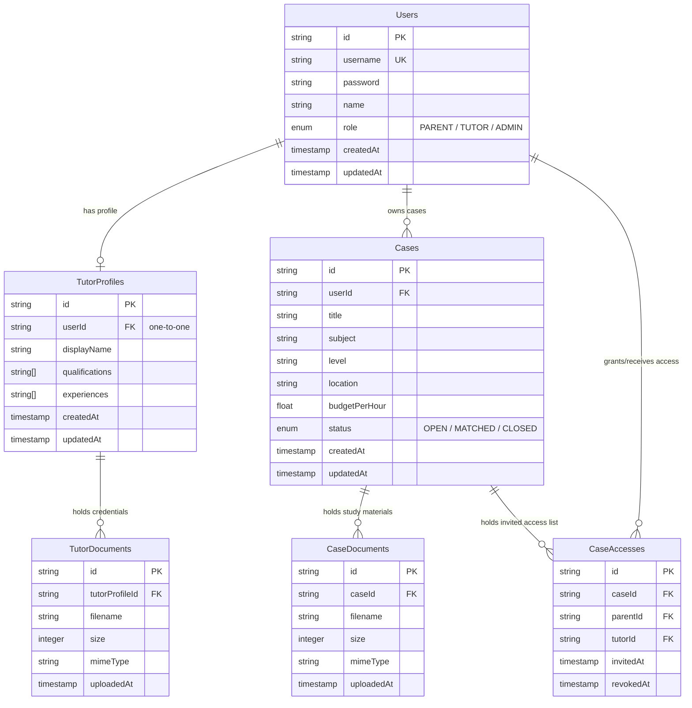

# Backend Planning & Architecture - Tuition Case Workspace

This folder contains the planning specifications, database designs, and API references for the **Tuition Case Workspace** backend service.

---

## 1. Document Index

- **System Architecture**: Read about the Express middleware stack and database pooling in [SYSTEM_ARCHITECTURE.md](./SYSTEM_ARCHITECTURE.md).
- **API Reference**: Read endpoint parameters and payload schemas in [API.md](./API.md).
- **Swagger Documentation**: Interactive OpenAPI explorer is available locally at `/api/docs`.

---

## 2. System Architecture Overview

The backend is built as a TypeScript-based Node/Express service:
- **Language**: TypeScript
- **Runtime**: Node.js
- **Routing Framework**: Express.js
- **Database**: PostgreSQL (Supabase)
- **ORM**: Prisma ORM

For details on security headers, cookie sessions, file uploads, and error handling, refer to the full [SYSTEM_ARCHITECTURE.md](./SYSTEM_ARCHITECTURE.md) document.

---

## 3. Entity Relationship Diagram (ERD)

### Mermaid Specification

